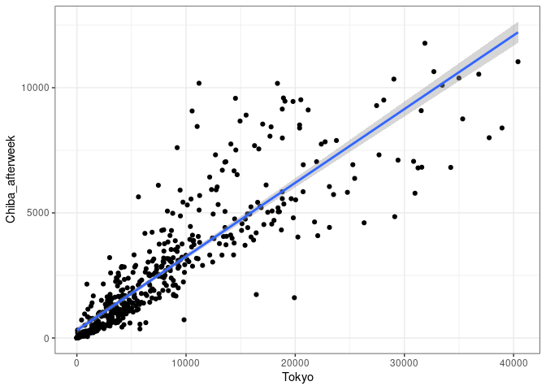

## My Shiny Application

This is a Shiny application as the project of “Developing Data Products”
course. I developed the shiny web which predicts the Chiba Prefecture
COVID-19 new patients after 7day by using neighboring region such as
Tokyo, Kanagawa, Saitama and Ibaraki Prefectures.  
Choosing the number of today’s new cases of neighboring region, the
shiny website calculate the number of forecast of Chiba Prefecture 7
days ahead.

The shiny application is on
<https://tom-mat.shinyapps.io/Week4_Shiny_Application/>

Shiny application (ui.R and server.R) code is in the following site:
<https://github.com/tommat2022/Developing_Data_Products>

## COVID-19 Japan dataset

The column “Chiba\_afterweek” shows the new cases of Chiba Prefecture 7
days ahead between 2021/01/01 and 2023/02/3 (dataset:
new\_case\_select).

    new_case_select <- read.csv("new_case_select.csv")
    head(new_case_select)

    ##         Date Tokyo Kanagawa Saitama Ibaraki Chiba Chiba_afterweek
    ## 1 2021-07-01   674      211     142      27   139             200
    ## 2 2021-07-02   660      230     125      23   149             180
    ## 3 2021-07-03   715      254     116      28   157             204
    ## 4 2021-07-04   518      226     124      30   141             183
    ## 5 2021-07-05   342      180      76      12   112             114
    ## 6 2021-07-06   592      198     137      17   138             180

## Neighboring region of Chiba Prefecture

## Multiple linear regression model

The current new cases of neighboring region explain 82.8% of the
forecast of Chiba

    logit <- lm(Chiba_afterweek ~ Tokyo + Kanagawa + Saitama + Ibaraki, data=new_case_select)
    summary(logit)[4]; summary(logit)[9]

    ## $coefficients
    ##                 Estimate  Std. Error   t value     Pr(>|t|)
    ## (Intercept) 132.50176327 62.25297146  2.128441 3.372288e-02
    ## Tokyo         0.05525195  0.02351515  2.349633 1.912744e-02
    ## Kanagawa      0.46443839  0.05862914  7.921630 1.208858e-14
    ## Saitama       0.14803924  0.07165979  2.065862 3.928656e-02
    ## Ibaraki      -0.21934887  0.08544679 -2.567081 1.050634e-02

    ## $adj.r.squared
    ## [1] 0.8282576

## Plot Example:

Tokyo and Chiba 7 days ahead

